.. raw:: html

    
    
    
    

Graphic User Interface
######################

The User Interface was mainly implemented in `JQuery Mobile <http://jquerymobile.com>`_, CSS, javascript and perl CGI. It is a HTML5-based user interface system designed to make responsive web sites and apps that are accessible on all smartphone, tablet and desktop devices.

The UI composed with **Home page**, **Run EDGE**, and **Project list** in the **Left navigation widget**, **Input and Analyses modules** in the Run EDGE page, **Job progress widget** (right navigation), **Action widget**, and **Report page**.

See  `GUI page <http://lanl-bioinformatics.github.io/edge/edge_ui/index.html>`_

.. note:: The above webpage link is for demo only. 

Start GUI
=========

To run gui, type::

    $EDGE_HOME/start_edge_ui.sh

will start a localhost and the GUI html page will be opened by the default Browser. 

.. note:: If desktop environment is available, after installation, a "Start EDGE UI" icon should be on the desktop. Click on the green icon" and choose "Run in Terminal" should be the same as above method to start the GUI.

.. image:: img/edge_desktop_icon.png
   :width: 200 px
   
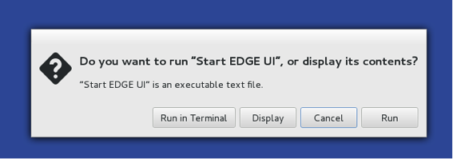
 
The URL address is 127.0.0.1:8080/index.html. It may be not powerful as it is hosted by Apache HTTP Server but it works. With system administrator help, the Apache HTTP Server is suggested to host the gui interface. 
 
.. note:: You may need to configure the edge_wwwroot and input and output in the edge_ui/edge_config.tmpl file while configuring the Apache HTTP Server and link to external drive or network drive if needed.

A Terminal window will display messages and errors as you run EDGE. Under normal operating conditions you can minimize this window. Should an error/problem arise, you may maximize this window to view the error. 

.. image:: img/Terminal_log.png
   :align: center

.. Warning:: IMPORTANT: Do not close this window!

The Browser window is the window in which you will interact with EDGE.

Initiating an analysis job
==========================

Choose “Run EDGE” from the navigation bar on the left side of the screen. 

.. image:: img/initiating.jpg
   :align: center

This will cause a section to appear called “Input Sequence.” Here, you may browse the EDGE Input Directory and select FASTQ files containing the reads to be analyzed.  EDGE will take as input at least either two FASTQ files containing paired reads and/or one FASTQ file containing single reads. 

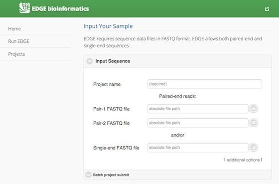

In addition to the input read files, you have to specify a project name. The project name is restricted to only alphabets, numbers, underscore and at least three characters. For example, a project name of “E. coli. Project” is not acceptable, but a project name of “E_coli_project” could be used instead. Besides, you have option to add more reads input field, click “additional options” to expose more fields, including two buttons for “Add Paired-end Input” and “Add Single-end Input” and “Description”. In “Description” fields you may enter free text that describes your project.

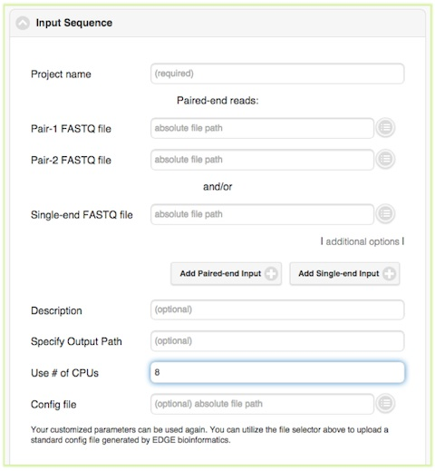

Below the “Description” field are several more options, for output path, number of CPUs, and config file. In most cases, you can ignore these options, but they are described briefly below.

Output path
-----------

You may specify output path if you would like your results to be output to a specific location. In most cases, you can leave this field blank and the results will be automatically written to a standard location $EDGE_HOME/edge_ui/EDGE_output. In addition to the field for specifying output path. In most cases, it is sufficient to leave these options to the default settings.

Number of CPUs
--------------

Additionally, you may specify the number of CPUs to be used. The default and minimum value is one-fourth of total number of server CPUs. Assuming your hardware has 64 CPUs, the default is 16 and the maximum you should choose is 62 CPUs. If there are multiple jobs being run simultaneously, you can adjust this value for job running immediately. Otherwise, if the total running job uses more than 64 CPUs, the new submitted will be queued (color in grey. Color-coding see :ref:`check_status`). For instance, if you have only one job running, you may choose 62 CPUs. However, if you are planning to run 6 different jobs immediately, you should divide the computing resources (in this case, 10 CPUs per each job, totaling 60 CPUs for 6 jobs).

Config file
-----------

Below the “Use # of CPUs” field is a field where you may select a configuration file. A configuration file is automatically generated for each job when you click “Submit.” This field could be used if you wanted to restart a job that hadn’t finished for some reason (e.g. due to power interruption, etc.). This option ensures that your submission will be run exactly the same way as previously, with all the same options. 

.. seealso:: :ref:`Example of config file <config_example>`

Batch project submit
--------------------

The “Batch project submit” section is toggled off by default. Click on it will open it up and toggle off the “Input Sequence” section at same time. 
When you have many samples in “EDGE Input Directory” and would like to run with a same configuration, instead of submit several times, you can compile a text file with project name, fastq inputs and optional project descriptions (upload or paste it) and submit through the “Batch project submit” section

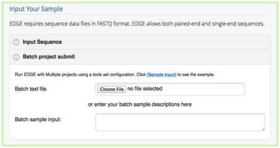

Choose processes/analyses
=========================

Once you have selected the input files and assigned a project name and description, you may either click “Submit” to submit an analysis job using the default parameters, or you may change various parameters prior to submitting the job. The default settings include quality filter and trimming, assembly, annotation, and community profiling. Therefore, if you choose to use default parameters, the analysis will provide an assessment of what organism(s) your sample is composed of, but will not include host removal, primer design, etc.
Below the “Input Your Sample” section is a section called “Choose Processes / Analyses”. It is in this section that you may modify parameters if you would like to use settings other than the default settings for your analysis (discussed in detail below)

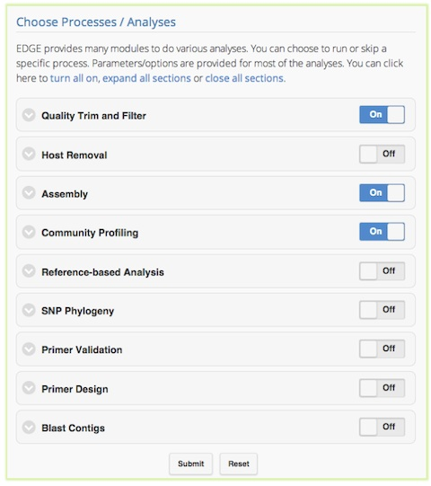

Quality trim and filter
-----------------------

Quality trimming and filtering is by default on, but can be turned off via the toggle switch on the right hand side. The default parameters for quality trimming and filtering should be sufficient for most cases. However, if your experiment involves specialized adapter sequences that need to be trimmed, you may do so in the Quality Trim and Filter subsection.
There are two options for adapter trimming. You may either supply a FASTA file containing the adapter sequences to be trimmed, or you may specify N number of bases to be trimmed from either end of each read.

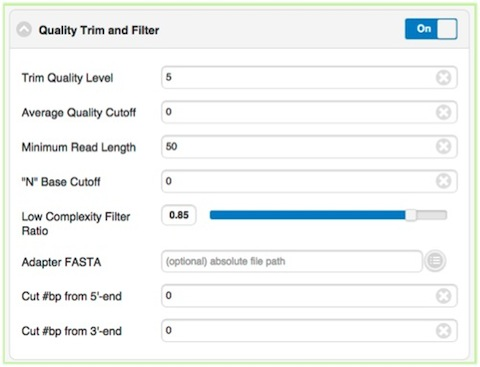

.. note:: Trim Quality Level is to trim reads from both end with defined quality.  "N" base cutoff is to filter read which has more than this number of continuous base "N". Low complexity is defined by the fraction of mono-/di-nucleotide sequence. Ref: `FaQCs <https://github.com/LANL-Bioinformatics/FaQCs>`_. 

Host removal
------------

The host removal section allows you to subtract host-derived reads from your dataset, which can be useful for metagenomic (complex) samples such as clinical samples (blood, tissue), or environmental samples like insects.
In order to enable host removal, within the “Host Removal” subsection of the “Choose Processes / Analyses” section, switch the toggle box to “On” and select either from the pre-build host list ( `Human <ftp://ftp.ncbi.nlm.nih.gov/genomes/H_sapiens/Assembled_chromosomes/seq/>`_ , `Invertebrate Vectors of Human Pathogens <https://www.vectorbase.org>`_ , `PhiX <http://www.ncbi.nlm.nih.gov/nuccore/NC_001422>`_ , `RefSeq Bacteria <ftp://ftp.ncbi.nih.gov/genomes/Bacteria/>`_ and `RefSeq Viruses <ftp://ftp.ncbi.nih.gov/genomes/Viruses>`_ .) or the appropriate host FASTA file for your experiment from the navigation field.
The Similarity (%) can be varied if desired, but the default is 90 and we would not recommend using a value less than 90.

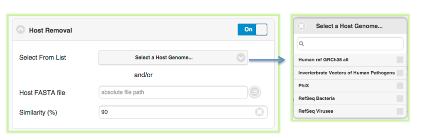

Assembly
--------

The Assembly by default is turned on. It can be turned off via the toggle button. EDGE performs iterative kmers de novo assembly by `IDBA-UD <http://i.cs.hku.hk/~alse/hkubrg/projects/idba_ud/>`_ . It performs well on isolates as well as metagenomes but it may not work well on very large genomes. By default, it starts from kmer=31 and iterative step by adding 20 to maximum kmer=124. When the maximum k value is larger than the input average reads length, it will automatically adjust the maximum value to average reads length minus 1. User can set the minimum cutoff value on the final contigs. Be default, it will filtered out all small contigs with size smaller than 200 bp.

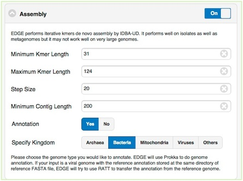

The Annotation module will be performed only the assembly is turn on and reads were successfully assembled. EDGE use `Prokka <http://www.vicbioinformatics.com/software.prokka.shtml>`_ to do genome annotation. If your input is a viral genome with the reference annotation (Genbank file), EDGE will try to use `RATT <http://ratt.sourceforge.net/>`_ to transfer the annotation from the reference genome. If the assembly failed with certain reason (ex: run out of Memory), EDGE will bypass any modules require contigs file including the annotation analysis.
   
Community profiling
-------------------

Taxonomic profiling is performed via the “Community Profiling” feature, which is a subsection of the “Choose Processes / Analyses” section. This is a useful feature not only for complex samples, but also for purified microbial samples (to detect contamination). In the “Community profiling” subsection in the “Choose Processes / Analyses section,” community profiling can be turned on or off via the toggle button.

.. image:: img/profiling.jpg
   :align: center

There is an option to “Always use all reads” or not. If “Always use all reads” is not selected, then only those reads that do not map to the user-supplied reference will be shown in downstream analyses (ie. the results will only include what is different from the reference). 
Additionally, user can use different profiling tools with checkbox selection menu. EDGE uses multiple tools for taxonomy classification including `GOTTCHA (bacterial & viral databases) <https://github.com/LANL-Bioinformatics/GOTTCHA>`_ , `MetaPhlAn <http://huttenhower.sph.harvard.edu/metaphlan>`_ , `MetaPhyler (short read version) <http://metaphyler.cbcb.umd.edu/>`_ , `Kraken <http://ccb.jhu.edu/software/kraken/>`_ , MetaScope and reads mapping to NCBI RefSeq using `BWA <http://bio-bwa.sourceforge.net/>`_ .

Reference-based Analysis
------------------------

The reference-based analysis section allows you to map reads/contigs to the provided references, which can be useful for known isolated species such as cultural samples to get the coverage information, and validate the assembled contigs.
In order to enable reference-based analysis, within the “Reference-based analysis” subsection of the “Choose Processes / Analyses” section, switch the toggle box to “On” and select either from the pre-build Reference list ( :ref:`Ebola genomes <ebola-ref-list>` , `E.coli 55989 <http://www.ncbi.nlm.nih.gov/nuccore/NC_011748>`_ , `E.coli O104H4 <http://www.ncbi.nlm.nih.gov/nuccore/NC_018658>`_ , `E.coli O127H6 <http://www.ncbi.nlm.nih.gov/nuccore/NC_011601>`_ and `E.coli K12 MG1655 <http://www.ncbi.nlm.nih.gov/nuccore/NC_000913>`_ .) or the appropriate FASTA/Genbank file for your experiment from the navigation field. 

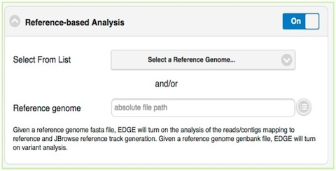

Given a reference genome fasta file, EDGE will turn on the analysis of the reads/contigs mapping to reference and JBrowse reference track generation. If genbank file is provided, EDGE will also turn on variant analysis.

SNP Phylogeny
-------------

EDGE supports 5 pre-computed databases ( :ref:`E.coli, Yersinia, Francisella, Brucella, Bacillus <SNP-db>`) for SNP phylogeny analsysis. When you know your input is related to one of the above list and would like to know its phylogeny, you can toggle on the module and specify the corresponding pathogen to perform the phylogeny tree analysis.

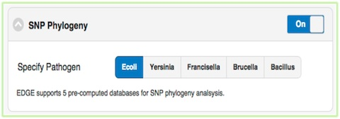

Primer validation
-----------------

The “Primer Validation” subsection of the “Choose Processes / Analyses” section, can be used to verify whether and where given primer sequences would align to the genome of the sequenced organism. Prior to initiating the analysis, primer sequences in FASTA format must be deposited in the folder on the desktop entitled “EDGE Input Directory.”

.. image:: img/pcrValidation.jpg
   :align: center

In order to initiate primer validation, within the “Primer Validation” subsection of the “Choose Processes / Analyses section” switch the toggle button to “On”. Then, within the “Primer Sequences” navigation field, select your file containing the primer sequences of interest. Next, in the “Maximum Mismatch” field, choose the maximum number of mismatches you wish to allow per primer sequence. The available options are 0, 1, 2, 3, or 4.

Primer design
-------------

If you would like to design new primers that will differentiate a sequenced microorganism from all other bacteria and viruses in NCBI, you can do so using the “Primer Design” subsection of the “Choose Processes / Analyses” section. There are default settings supplied for Melting Temperature, Primer Length, Tm Differential, and Number of Primer Pairs, but you can change these settings if desired.

.. image:: img/pcrDesign.jpg
   :align: center

Blast Contigs
-------------

Turning on “Blast Contigs” section and provided the path to the nt/nr database will blast the assembled contigs against nr/nt/virulence databases for taxonomy and functional annotations. If a reference genome is provided, it will only use unmapped contigs to do blast analysis. 

.. image:: img/blast.png
   :width: 480px
   :align: center
   
Job submission
==============

When you have selected the appropriate input files and desired analysis options, and you are ready to submit the analysis job, click on the “Submit” button at the bottom of the page. Immediately you will see indicators of successful job submission and job status below the submit button, in green. If there is something wrong for the input, it will stop the submission and show the message in red and highlight the sections with issues. 

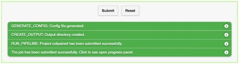
   
.. _check_status:

Checking the status of an analysis job
======================================

Once an analysis job has been submitted, it will become visible in the left navigation bar. There is a grey, red, orange, green color-coding system that indicates job status as follow:

.. role:: grey
.. role:: red
.. role:: orange
.. role:: green

======  ===================== ============ =============================== ==================
Status  :grey:`Not yet begun` :red:`Error` :orange:`In progress (running)` :green:`Completed`
======  ===================== ============ =============================== ==================
Color   :grey:`Grey`          :red:`Red`   :orange:`Orange`                :green:`Green`
======  ===================== ============ =============================== ==================

While the job is in progress, clicking on the job in the left navigation bar will allow you to see which individual steps have been completed or are in progress, and results that have already been produced. Clicking the job progress widget at top right opens up a more concise view of progress.

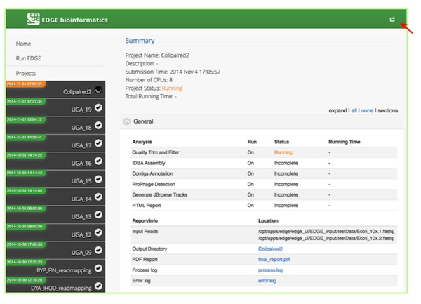
   
.. image:: img/status2.png
   :width: 600px
   :align: center

Monitoring the Resource Usage
=============================

Opening the job progress widget (top right), there is an “EDGE Server Usage” widget, which is dynamically monitoring the server resource usage for %CPU, %MEMORY and %DISK space.  If disk space is not enough, you may consider deleting or archiving the submitted job with Action widget described below.

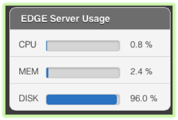

Job Management
==============

Should you desire to delete a job that is in progress, you can do so by selecting the job in the left navigation bar and clicking the job progress widget in the green area on the top right side of the screen. This will open a more concise summary of job status, which has a “Delete entire project” button in the “Action” widget. 

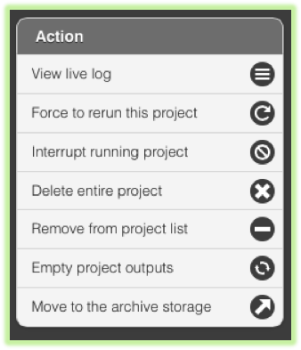
   
There are other job management functions in the “Action” widget, which is summarized below. 

* **View live log**
  
  A terminal-like screen showing all the command lines and progress log information. This is useful for troubleshooting or you want to repeats certain function through command line at edge server. 

* **Force to rerun this project**
  
  Rerun a project with the same inputs and configuration. No additional input needs.

* **Interrupt running project**
  
  Immediately stop a running project.

* **Delete entire project**
  
  Delete the entire output directory of the project.

* **Remove from project list**
  
  Keep the output but remove project name from the project list

* **Empty project outputs**
  
  Clean all the results but keep the config file. User can use this function to do a clean rerun.

* **Move to an archive directory**
  
  For performance reason, the output directory will be put on local storage. User can use this function to move projects from local storage to a slower but larger network storage, which are configured when the edge server installed.
