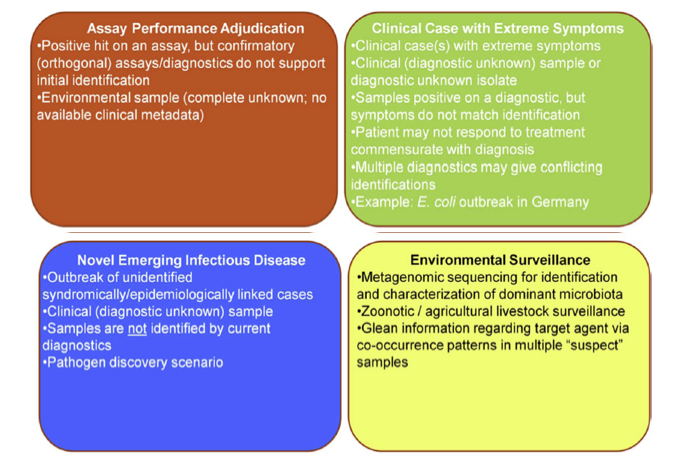

Introduction
############

What is EDGE?
=============

EDGE is a highly adaptable bioinformatics platform that allows laboratories to quickly analyze and interpret genomic sequence data. The bioinformatics platform allows users to address a wide range of use cases including assay validation and the characterization of novel biological threats, clinical samples, and complex environmental samples. EDGE is designed to:

* Align to real world use cases
* Make use of open source (free) software tools
* Run analyses on small, relatively inexpensive hardware
* Provide remote assistance from bioinformatics specialists 

Why Create EDGE?
================

There is a need for user-friendly bioinformatics solutions that can be provided to OCONUS labs to facilitate successful adoption of High-Throughput Sequencing (HTS) technologies. This is critical because overseas deployment of sequencers allows the technology closer to acquisition point of samples, thereby avoiding political issues associated with removal of strains/samples from host contries. In addition, sequencing specimens closer to the source can also decrease the timeline involved in identification and characterization of unknow agents, and acquisition of information that can be used for force health protection.

